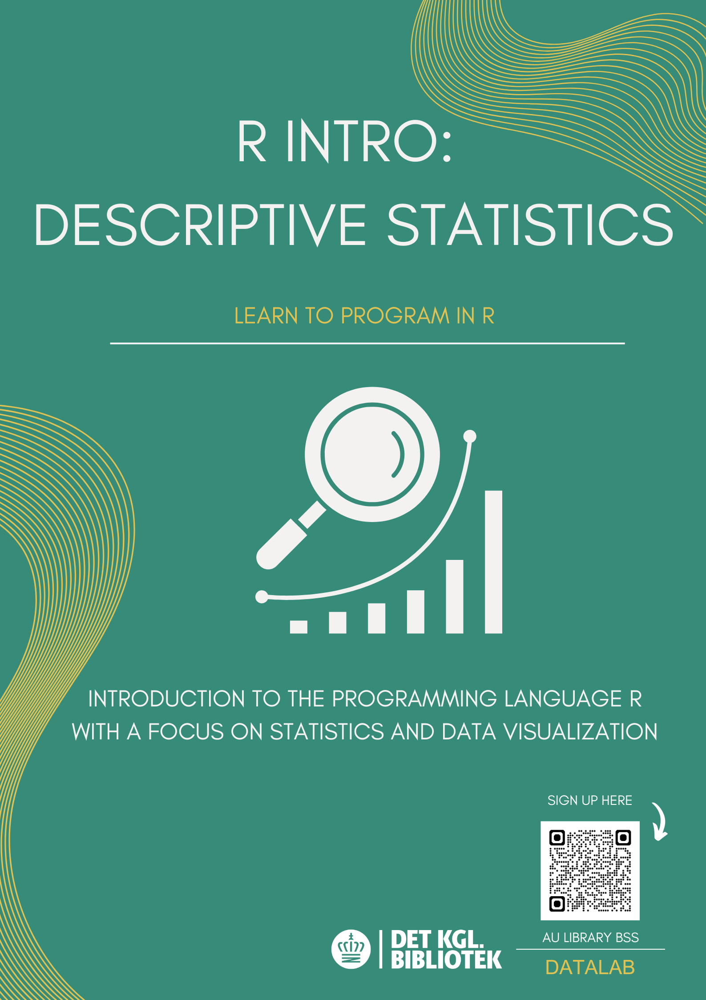

# R Intro - Descriptive Statistics
In this workshop, you will be introduced to the programming language R and the graphical user interface RStudio, where we will write and run our code. The workshop is aimed at beginners, meaning there are no expectations that you have prior programming experience. If possible, please install R and RStudio on your computer before the workshop or create an account on the browser version of RStudio. Instructions can be found at the bottom of this page.

The workshop will cover descriptive statistics, including:

How to navigate in RStudio
How to load an Excel file into R
How to use basic statistical functions
How to create visualizations

# Data
In the data folder, you will find the raw data we will use in the workshop. Our data comes from Erik Gahner Larsen's book 'Introduction to R' (2022) and contains various information related to parliamentary elections in Denmark. Our data is in an Excel file divided into two sheets. The first sheet contains a table of the number of votes divided by party, and the second sheet contains a table of the number of mandates divided by party. You can see an overview of parties, names, and various abbreviations here: GitHub Repository.

# Accessing R and RStudio
## Locally

### 1. Install R:
Download the latest version of R to your computer. Be sure to choose a version that matches your computer's operating system. R is the 'language' we will use for programming.
R can be downloaded here: Download R.

### 2. Install RStudio:
Download the latest version of RStudio to your computer. Again, make sure to select a version that matches your operating system. RStudio is the application where we will write our code. It is RStudio that we open when we want to program.
RStudio can be downloaded here: Download RStudio.

# Via a Browser:
### Go to Posit Cloud
If you wish to access R and RStudio from a browser, simply follow this link: Posit Cloud. Here, you can either create a free account or log in if you already have one.

# 
 

# Further Work in R
If you are interested in learning more about R, these books are an excellent place to start. The books come with a series of exercises that can prepare you well for your further work in R.

Introduktion til R from 2022 by Erik Gahner Larsen

An Introduction to R from 2024 by Alex Douglas, Deon Roos, Francesca Mancini, Ana Couto & David Lusseau: https://intro2r.com/rsprojs.html

R for Data Science (2e) from 2023 by Hadley Wickham, Mine Çetinkaya-Rundel and Garrett Grolemund: https://r4ds.hadley.nz/

Text Mining with R: A Tidy Approach from 2024 by Julia Silge and David Robinson: https://www.tidytextmining.com/
